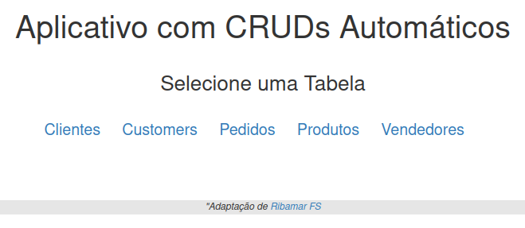

# Aplicativos Automáticos

Temos apenas duas classes, Connection() e Crud() com bons métodos e os arquivos básicos do CRUD em core. Você não precisará digitar nenhum nome de campo e nenhuma linha de código. Ele gerará automaticamente o código de um CRUD para cada tabela do banco de dados, não importando quantas sejam.

## no-code
Esta é uma ferramenta que há algum tempo se chama de RAD (Rapid Application Developer) e atualmente se chama de no-code, pois podemos criar aplicativos para qualquer banco, com qualquer quantidade de tabelas automaticamente e sem uma única linha de código.

## URL deste projeto

https://github.com/ribafs/auto-app

## Capturas do auto-app

### Busca

## Requisitos:

- PHP (estou usando a 7.2, mas deve funcionar também nas 5.x)
- Servidor web suportado pelo PHP, inclusive o nativo
- MySQL ou PostgreSQL (com pequenas adaptações também roda nos demais suportados pelo PDO)
- Permissão de escrita para o servidor web na pasta do aplicativo (em sistemas Linux ou similares)
- Para que tudo funcione a contento precisa que cada tabela tenha a chave primária chamada "id". Existe como capturar o nome da chave primária de cada tabela mas me daria mais trabalho.

## Recursos:

- PHP com PDO
- Paginação de resultados com bootpag
- Busca integrada
- BootStrap 3

## Instalação:

- Faça o download e descompacte no diretório web. Exemplo: /var/www/html/auto-app ou c:\xampp\htdocs\auto-app
- Crie o banco de dados e importe o script db.sql ou use um banco existente
- E chame pelo navegador com - http://localhost/auto-app

## Origem

Este software partiu do aplicativo "crud_phpoo" do retpositório:
https://github.com/ribafs/aplicativos-php

## Para mudar de tabela:

- Pode editar manualmente o classes/connection.php
- Ou simplesmente remover o classes/connection.php e chamar novamente - http://localhost/auto-app

## Aprendizado:

A construção deste software me adicionou um grande aprendizado de PHP, especialmente sobre os metadados do MySQL e PostgreSQL e sobre a manipulação de strings. Caso seja um programador iniciante ou médio de PHP recomendo que estude o código para aprender os conhecimentos envolvidos.

## Projetos similares

- https://github.com/ribafs/auto-crud
- https://github.com/ribafs/crud-generator
- https://github.com/ribafs/no-code-listing
- https://github.com/ribafs/crud-generator-laravel-br
- https://github.com/ribafs/view-maker
- https://github.com/ribafs/laravel-acl
Entre outros

## Alerta
Lembre que o aplicativo gerado é algo simples, sem suporte nativo a relacionamentos e outras limitações. Imagino que possa ser util, especialmente como aprendizado do código usado.

## Créditos

A paginação básica que utilizei para criar este aplicativo foi encontrada no site abaixo:

https://www.kodingmadesimple.com/2017/01/simple-ajax-pagination-in-jquery-php-pdo-mysql.html

## Licença

MIT

## Sugestões

Serão muito bem vindos:
- Issues (erros, sugestões)
- Forks
- Pull Requests

