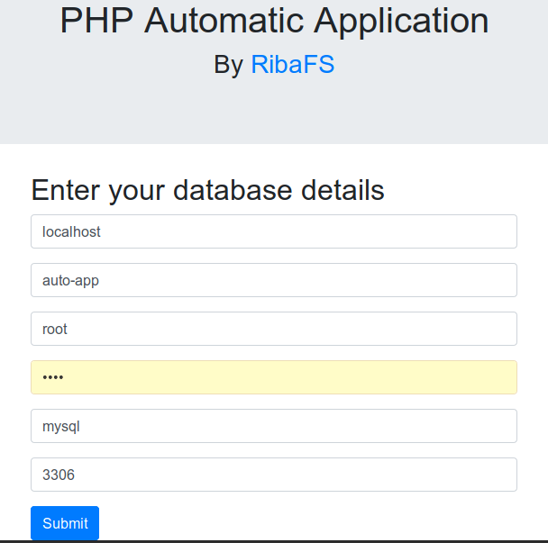

# PHP Automatic Application

## Em Português
 https://github.com/ribafs/auto-app/tree/master/pt_BR

Are only two classes, Connection() and Crud() with good methods and the basic files from CRUD. You will not have to type any field names and no lines of code.
It will automatically generate the code of a CRUD for each table in the database, no matter how many.

## This project URL

https://github.com/ribafs/auto-app

### Download

https://github.com/ribafs/auto-app/archive/master.zip

## Requirements:

- PHP (Im using 7.2, but should also work in the 5.x)
- All web server supported by PHP, including native
- MySQL or PostgreSQL (with small adaptations also rotates in the others supported by the PDO)
- Writing permission to the web server in the application folder (on Linux systems or similar)
- For everything to work properly you need each table to have the primary key called "id".

## Good Resources:

- PHP with PDO
- Pagination of results with bootpag
- Integrated search
- BootStrap 4

## Installation

- Make download and uncompress in your web directory. Example: /var/www/html/auto-app or c:\xampp\htdocs\auto-app
- Create a database, import script db.sql or use a existing database
- Call by browser with - http://localhost/auto-app
- It will open the form for entering the data of the bank, as below:

- Enter the database info and click in Send.
- Then you will already be in front of the menu with links to all database tables, as the screen below

Select a table clicking in your link to access your CRUD, as the screen below

Now try and see anothers features.

## Origin

This software started from the application "crud_phpoo" from repository:

https://github.com/ribafs/aplicativos-php

## To change table:

- You can manually edit the classes/connection.php
- Or simply remove the classes/connection.php and call again - http://localhost/auto-app

## Learning:

A construção deste software me adicionou um grande aprendizado de PHP, especialmente sobre os metadados do MySQL e PostgreSQL e sobre a manipulação de strings. Caso seja um programador iniciante ou médio de PHP recomendo que estude o código para aprender os conhecimentos envolvidos.
Building this software has added me a great learning of PHP, especially on the MySQL and PostgreSQL metadatas and on the string manipulation. 

## Automatic Aplications

Using this software I create another proejct and call auto-app, which does this same magic but for all the tables of a bank.

https://github.com/ribafs/auto-app

## Credit

The basic pagination I used to create this application was found at the following site::

https://www.kodingmadesimple.com/2017/01/simple-ajax-pagination-in-jquery-php-pdo-mysql.html

## Limitations

This software does not contemplate relationship between tables or combos for related fields. If you need an application with this and even more features create with the CakePHP bake.

## License

MIT

## Suggestions are will be very welcome:

- Issues
- Forks
- Pull Requests

